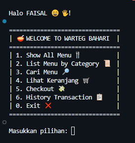

# Food Ordering CLI Application

This project is a command-line interface (CLI) application built in Go language to demonstrate ordering system: food, drink, snack, and etc. It allows users to browse menus by category, search for items, add items to a cart, checkout, and view transaction history. Additionally, it showcases how to communicate and pass data between modules/packages in a Go application.

## Preview



## How to Run This Project
Follow these steps to set up the project locally:

1. Clone the repository:
   ```bash
   git clone https://github.com/VsalCode/fgo24-go-weeklytask.git
   ```

2. Navigate to the project folder:
   ```bash
   cd fgo24-go-weeklytask
   ```

3. initialize the Go module :
    ```bash 
    go mod init weeklytask-8
    ```

4. Install dependencies (if any):
   ```bash
   go mod tidy
   ```
5. Running the Project:
   ```bash
   go run main.go
   ```

## How to Contribute
Pull requests are welcome! For major changes, please open an issue first to discuss your proposed changes. Ensure tests are updated as needed. Create a new branch for your changes to keep your work organized.

## License
This project is licensed under the [MIT License](https://opensource.org/license/mit)
